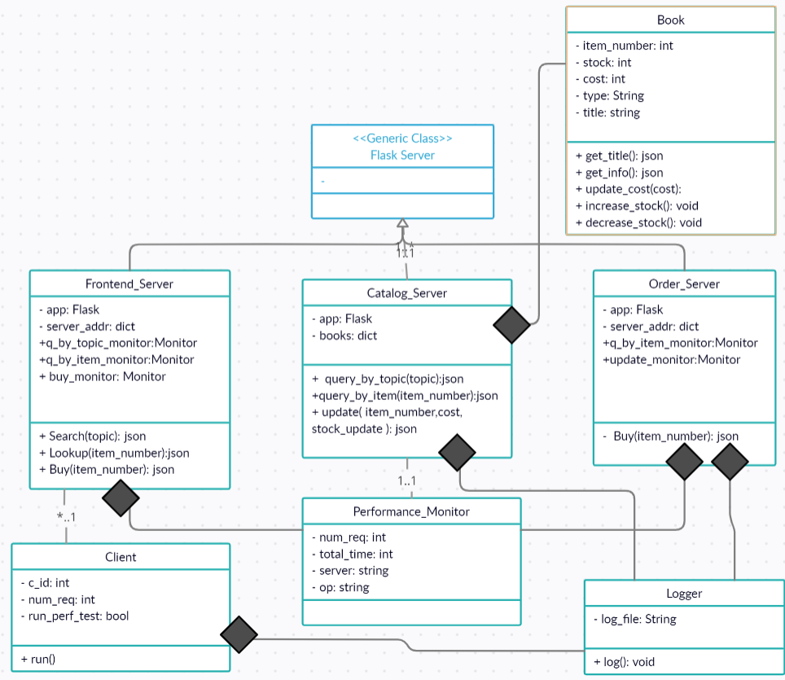
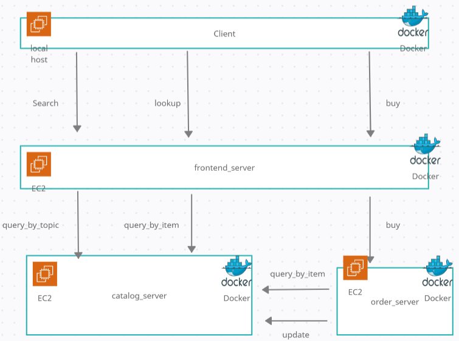
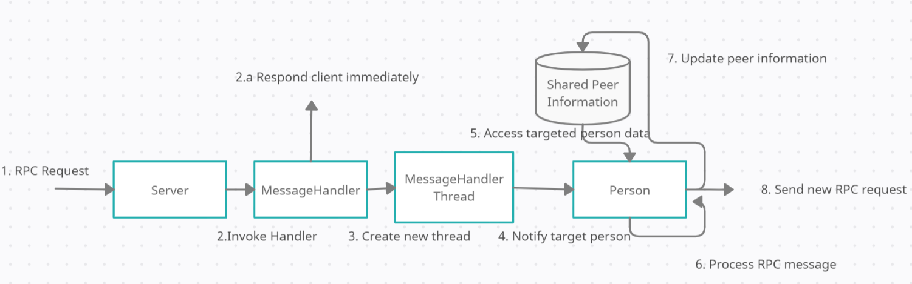

# My Bazaar Design Doc

Authors: Chih-Che Fang, Shivam Srivastava, Shiyang Wang

# Problem description

This project is a simple distributed program that implements a peer-to-peer market, The bazaar contains two types of people (i.e., computing nodes): buyers and sellers. Each seller sells one of the following goods: fish, salt, or boars. Each buyer in the bazaar is looking to buy one of these three items.
Buyers find sellers by announcing what they wish to buy or sell. All announcements must follow the peer-to-peer model. Each buyer shall communicate their needs to all her neighbors, who will then propagate the message to their neighbors and so on, until a seller is found or the maximum limit on the number of hops a message can traverse is reached.
If a seller is found, then the seller sends back a response that traverses in the reverse direction back to the buyer. At this point, the buyer and the seller directly enter into a transaction (without using intermediate peers).

# System Design

## UML Class Diagram

## Class Discription  
**Person:** A person represents a peer. It's an abstract (Super-class) class of buyers, sellers, and peer with no role, define all required attributes and actions (lookup/buy/sell) each peer must have.  
**Buyer:** A buyer peer, implements buy/sell/lookup and inherit all attributes from person class.  
**Seller:** A seller peer, it implement buy/sell/lookup and inherit all attributes from person class.  
**NoRole:** Peer with no role, it implement buy/sell/lookup and inherit all attributes from person class.  
**Server:** A server represents the RPC server that resides in each peer.  
**Client:** A client represents the RPC client used to access the remote RPC server.    
**SystemMonitor:** A class used to store and calculate the latency/average response time of client requests.  
**AddressLookUp:** A (neighbor, IP) mapping lookup owned by each peer, allowing a peer to send RPC requests to other peers.  
**Logger:** A class used to output important output for each test case. We can therefore verify the correctness of each test case.  
**MessageHandler:** The class defines how RPC server handle a message  
**MessageHandlerThread:** The message handler will create a new message handler thread to process each new request. This class defines the specific logic of how to handle each type of message.  

## Interface Discription:  
**Buy:** Interface that defines how buyers respond to the seller to buy a product.  
**LookUp:** Interface that defines how a buyer search the network; all matching sellers respond to this message with their IDs using a reply(buyerID, sellerID) call.  
**Sell:** Interface that defines how a seller responds to a buyer if the seller has the product the buyer likes.  

## Sequence Diagram
**Peer Interaction Workflow**  

Notice that the seller will send a buy ack back to the buyer if the buyer successfully bought the product. We add buy ack to handle with a race condition that seller might reply to multiple buyers but only one buyer can buy the product, which means buy request from a buyer doesn't necessarily succeed each time. We must let the buyer know if they successfully bought the product or not.  

**RPC Request Handling Workflow**  

# How it Works
 ## Bootstraping & Communication
We applied XML-RPC framework as a peer communication way. Each peer is at the same time an RPC server and RPC client. When a peering is created, it launches a listening RPC server to keep receive client requests from remote peers. Since each peer has global knowledge (Ex. Other peer's IP and port address, what neighbor it has, etc...) of the network topology, it can send a search request to discover neighbors and wait for their response. In contrast, if a peer receives a request from peers, it knows the IP/port address and can respond to the peer. 

The server maps its message handler to a class. In our system, it maps its message handler to MessageHandler class and the class will implement the logic of how to handle each type of message. For each new request, the MessageHandler will launch a new thread to process it.

## RPC Message Format
We used our customized RPC message as follows:  
Format = **[Action arg1 (arg2) msgPath sentTo]**  

**Action:** Indicate whether it is a buy/sell/lookup request  
**arg1, arg2:** Argument of the request  
**msgPath:** The path of the message, used by reply message to traverse the original route back to the buyer.  
**sentTo:** Indicate what peer the message is sending to. The information is used by the RPC server to deliver this request to the right peer.  

Here is one example of RPC message that seller ID 1 sent a reply message back to buyer ID 0 along with path 0-1:
[Reply 1 0 1 01 0 ]

## Global IP/Port Address Configuration
To allow peers to communicate with each other, we need to give them other peer's addresses and port, we use a file - config.txt to record the information.
Format = **[PeerID, IPAddress:Port]**  

**PeerID:** ID of the peer  
**IPAddress:Port:** The peer's ipv4 address and listening port  

Here is one example of configt file:  
0,127.0.0.1:8080  
1,127.0.0.1:8081  
2,127.0.0.1:8082  
3,127.0.0.1:8083  
4,127.0.0.1:8084   

## Concurency / Race Condition Protection
When a RPC server receives a new client request, its message handler will launch a new thread to process the message. To enable concurrent message processing, our peer-to-peer distributed system use a shared file to store the information of each peer (Ex. product, type, item count, etc...). Therefore, the information of each peer needs to be protected and we used a lock to protect the shared peer information. When a peer read/write its data, we ensured the whole operation and process is atomic and therefore avoid the race condition. To be more specific, it avoids that a seller with only 1 item sell multiple products to products to a buyer (Since a seller may send multiple replies to different buyers)

## Peer Shared Information Format
We store the shared peer information and named it as info-id with the format:  
Format = **[type peerID Product NeighborID Count TestName]**

**type:** Indicate whether the peer is a buyer, seller, or no-role. When the value is "na", the system randomly assigns a type to this peer.  
**peerID:** The peer's ID  
**Product:** The product the buyer wants to buy or a seller wants to sell. When the value is "na", the system randomly assigns a product to this peer.  
**NeighborID:** Indicate all peer IDs that are neighbored to the peer. Neighbor ID is split by ",".  
**Count:** Number of products left to sell.  
**TestName:** Indicate the test name where the peer belongs to. It is used to mark what test the output log belongs to.  

Here is one example of shared peer information that a buyer wants to buy fish and is neighbored with peer 2 & 3:
[b 1 fish 2,3 0 test1]

## Automatic Multiple Server Deployment
### Pre-created AMI image  
We already create a Amazon Linux2 AMI image with JDK 8 installed and made it public to access, later we can create new EC2 instances from the image, it provides us a machine that is able to compile the code and run the system  

### Dynamic creation of key pair
We will create a key pair in AWS account for latter access of EC2 instances  

### Dynamic server creation
We have pr-created Amazon AMI image that has Java SDK 8 installed. We dynamically create a security group that allows RPC access permission. We create an EC2 instance from the pre-created AMI image and attached it with the created security group. We tag each EC2 instance with a tag MyBazaar32144321" so that we can later access them and release them.

### Dynamic code mgration and compliation
We migrate the latest code to the remote server using SCP and invoke script linux_complie.sh to compile the code using ssh.

### Run test 1 ~ test 4
We write peer initial state (Ex. type, product, neighbors, etc...) to info-id and generate global topology knowledge (Each peer's IP/port address) into config.txt using. Then we deploy the peers in each server (EC2 instance) using ssh. We wait a certain amount of time and kill all the peers after each test. Doing the same routine until all the tests finished.

### Gather test output(log) for validation
We use SCP to pull test output under the output folder from all remote servers. We store the output from each server to the local machine's output folder. Ex. If server1's IP address is 128.0.35.1, we store the output to output\128.0.35.1. Since all output is tagged with test name, we know which test and what is the machine the output belongs to. We used this information to validate if the distributed system act as we expect.

### Release AWS resource
We terminate all EC2 instances and delete the security group and key pairs created previously at the end of the test

# Validation & Test
## Test Cases
**Test1 (Milestone1):** Assign one peer to be a buyer of fish and another to be a seller of fish. Ensure that all fish is sold and restocked forever.  
**Test2 (Milestone1):** Assign one peer to be a buyer of fish and another to be a seller of boar. Ensure that nothing is sold.  
**Test3 (Milestone1):** Randomly assign buyer and seller roles. Ensure that items keep being sold throughout  
**Test4 (Milestone2, Simulation of Race Condition):** One seller of boar, 3 buyers of boars, the remaining peers have no role. Fix the neighborhood structure so that buyers and sellers are 2-hop away in the peer-to-peer overlay network. Ensure that all items are sold and restocked and that all buyers can buy forever. **(This case also simulate race condition)**  
**Test5 (Milestone3):** Run test1~test4 again, but deploy peers on different AWS EC2 instances.  

## Automatic Test Scripts
**run_local_test.bat:** This script will automatically compile the code and perform test 1 ~ test 4 in order on a local machine. Finally, store output under the output folder for validation.  

**run_distributed_test.bat:**  This script will automatically create Amazon EC2 instances, migrating & compiling the code and config file to remote servers, deploying peers on the remote server, perform test 1 ~ test 4 in order on remote EC2 instances. Finally, store output under the output folder for validation and release all cloud resources. For more detail please see the chapter, "How it Works/Automatic Multiple Server Deployment".  

## Test Output (Log)  
We store all testing output under the output folder and use them to validate the correctness of each test case. For local testing, each file is named with testID.out (Ex. test4.out). It will print all peers' logs on that machine, like which buyer bought a product or which seller sold a product. For distributed testing on different servers, we store all remote server's output under output/IP address (Ex.output/127.35.6.1). In this way, we know which test and machine this log/output belong to and easy to debug. Here is one output example of test1:  

SellerID:1 start to sell fish  
BuyerID:0 start to buy fish  
SellerID:1 start to sell fish  
BuyerID:0 bought fish from 1  
BuyerID:0 start to buy fish  
SellerID:1 start to sell boars  
BuyerID:0 bought fish from 1  
BuyerID:0 start to buy fish  

## Verification of All Test Cases  
**Test1 output:**  
BuyerID:0 start to buy fish  
SellerID:1 start to sell fish  
SellerID:1 start to sell fish  
BuyerID:0 bought fish from 1  
BuyerID:0 start to buy salt  
**Result:** Pass, buyer 1 successfully buy out fish from seller 1  

**Test2 output:**  
BuyerID:0 start to buy fish  
SellerID:1 start to sell boars  
**Result:** Pass, buyer 1 buy nothing, seller 1 sells nothing  

**Test3 output:**  
BuyerID:0 start to buy boars  
BuyerID:1 start to buy salt  
**Result:** Pass, buyer 1 buy nothing, seller 1 sells nothing  

**Test4 output:**  
SellerID:1 start to sell boars  
PeerID:5 with no role start to work  
BuyerID:2 start to buy boars  
BuyerID:0 start to buy boars  
BuyerID:3 start to buy boars  
PeerID:4 with no role start to work  
SellerID:1 replied buyerID:0  
SellerID:1 replied buyerID:2  
SellerID:1 replied buyerID:3  
SellerID:1 start to sell boars  
SellerID:1 start to sell fish  
BuyerID:2 bought boars from 1  
BuyerID:2 start to buy fish  
SellerID:1 replied buyerID:2  
SellerID:1 start to sell salt  
BuyerID:2 bought fish from 1  
BuyerID:2 start to buy fish  
**Result:** Pass, buyer 0,2,3 want to buy boars from seller 1, and seller 1 also replied all of them (race condition), only buyer 2 baught boars from seller 1 successfully  

**Test5 output: (Run on distributed servers, log is collect from different servers)**  
BuyerID:2 start to buy boars  
BuyerID:0 start to buy boars  
SellerID:1 start to sell boars  
PeerID:5 with no role start to work  
PeerID:4 with no role start to work  
BuyerID:3 start to buy boars  
SellerID:1 replied buyerID:0  
SellerID:1 replied buyerID:3  
SellerID:1 replied buyerID:2  
SellerID:1 start to sell boars  
BuyerID:3 bought boars from 1  
SellerID:1 start to sell fish  
BuyerID:3 start to buy boars   
SellerID:1 start to sell salt  
SellerID:1 replied buyerID:2  
SellerID:1 start to sell salt  
BuyerID:2 bought salt from 1  
BuyerID:2 start to buy fish  
**Result:** Pass, buyer 0,2,3 want to buy boars from seller 1, and seller 1 also replied all of them (race condition), only buyer 3 baught boars from seller 1 successfully  

# Evaluation and Measurements
## 1.	Compare the latencies to process an RPC call between peers on different servers, as well as latencies between peers on your local machine(s)  

Latency (multiple servers) | Latency (single server)
------------ | -------------
100ms | 13ms  

*PS: latency calculated from 1000 sampled RPC requests

Results show latency on a single machine is much less than the latency when peers are deployed on multiple different servers. It's reasonable due to the network transportation time and marshaling/unmarshalling process of RPC call. In a single machine, the latency doesn't include network transportation time while in multiples servers network transporting time matters.

## 2.	Compare the response times when multiple clients are concurrently making requests to a peer, for instance, you can vary the number of neighbors for each peer and observe how the average response time changes, make necessary plots to support your conclusions.  

Avg Response Time (1 neighbor) | Avg Response Time (3 neighbor) |  Avg Response Time (5 neighbor) |  Avg Response Time (9 neighbor)
------------ | ------------- | ------------- | -------------
5.1327ms | 5.12ms | 5.26ms  |  5.28ms

PS: all response time sampled from 1000 requests
PS: We defines response time as the time the client receives responses from remote servers, the time doesn't imply the message is being processed since we use asynchronous RPC call design, the server will launch a new thread whenever it receives a request from a client, sending a message to background processing, and respond to client immediately.  

Results show averaged response times are almost the same (only a slight increase) as multiple clients are making requests to a peer. It matches what we expected since our system design will launch a new thread whenever receive a client request. The response time shouldn't be affected by the number of concurrent request since the server respond to clients as soon as it receives the request. However, we still see a little increase in average response time, I think it might be affected by the time used to launch a new thread. As more requests receive concurrently, the server spends some time launching a new thread, which causes a slight difference.  

# Design Tradeoffs
**RPC/RMI Call V.S Socket**  
We must choose one of the ways for communication among peers. The pros of RPC/RMI is:    
1. Allow user to define communicate interface, more human-readable and concise  
2. Don't need to worry about low-level networking communication implementation  
3. Remove the complexity of low-level networking communication implementation  

The cons of RPC/RMI:  
1. Reduced flexibility on low-level networking implementation and communication interface  

We finally choose to use RPC as our peer communication since we want to hide the complexity of lowe-lever networking communication, making the system more simple, concise, and easy to debug. Also, this assignment doesn't require us to implement a difficult connection fault tolerance or mechanism, we don't need a socket for flexibility.  

**Synchronous RPC Call V.S Asyncrounous RPC Call**  
The pros of using Synchronous RPC is:
1. Don't need to worry about concurrency issues caused by multi-thread  
2. Lower complexity of system design. 
The cons of Synchronous RPC is:  
1. Impaired performance (throughput) if multiple requests happen concurrently.  
2. Higher latency 

We finally chose Asyncrounous RPC Call since we want better performance(throughput) and shorter response time of message processing. We used a lock and shared data to overcome the concurrent issue caused by multi-thread.  

**Thread Pool V.S Dynamically Creating New Thread**  
To handle client RPC requests, we can choose either to launch a new thread every time or use the existing thread pool to allocate thread to message processing task. The pros of Thread Pool is:  
1.Shorter response time of client request since we don't need to create new thread dynamically  
The cons are:  
1. Higher complexity of system since we need to handle the creation and recycle of threads  
2. Higher memory usage since we must maintain a certain amount of thread  
3. Hard to debug  

We finally choose Dynamically Creating New Thread since the message handler thread doesn't have too many data attributes and creating is fast. Given that performance doesn't have too much difference and we want to simplify our design, we can dynamically creating a new thread to handle RPC client requests.

**Dynamic Creation of EC2 Instances V.S Hot Stand-By EC2 Instances**  
When launching multiple servers for peer deployment, we must choose between whether to dynamically creating new instances or deploy peers on hot standby servers. The pros of dynamic creation of EC2 Instances are:  
1. Lower cost of AWS EC2 instance (EC2 bills by running time of instances)  
The cons of a hot stand-by EC2 instance is:  
1. Longer deployment time since we need to wait for instances to be created  
2. Need to re-migrate and compile code every time we update our code  

We finally chose Dynamic Creation of EC2 Instances since the cost is significant if we maintain a lot of running EC2 instances. We write a script to quickly creating a security group and instances when deploying.  

**Open All TCP Port between Different Remote Server V.S Open only certain range of TCP Port between Different Remote Server**  
To allow RPC access permission between different servers so that peers can communicate with each other. We attached the Amazon security group to each Amazon EC2 instance to implement this permission control. The pros of opening all TCP Port between Different Remote Serve is:  
1. Don't need to worry about port range change (Ex. Add/Deletion) as we may want to add a new port to a peer  
2. Easy to configure  
The cons are:  
1.  Impaired security since if one of the servers is malicious, it can exploit and attack the opened port  

We finally chose to open only a certain range of TCP ports between Different Remote Server. We use a script to automatically create a security group to save the effort of changing the port in the future.

# How to Run It

See [README.md #How to run?](https://github.com/Chih-Che-Fang/MyBazaar#how-to-run "How to run")

# Possible Improvements and Extensions

1. We assume the id of hosts has to be ascending sequence, otherwise it will cause errors.
2. We are using the thread per request model currently we could be optimized by using thread pool or even coroutine.
