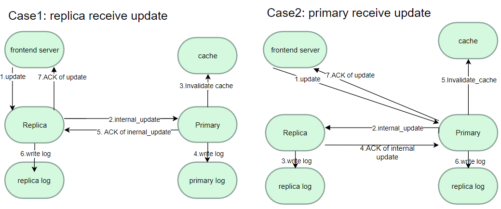

# My Book Store Design Doc

Authors: Chih-Che Fang

# System Design

## UML Class Diagram
### Backend Components

### Frontend + Client Componets

## Class Discription  
### Server Package
- **FrontendServer:** frontend server that process and dispatch client's request  
- **CatalogServer:** catalog server that host book information and can serve update, query_by_item, query_by_topic request from frontend and order server   
- **OrderServer:** order server that process frontend server's buy request  
- **CacheServer:** Cache server that store must recent & consistent search/query results  

### Communication Package
- **LoadBalancer:** A class used to direct HTTP request to replicated server evenly  
- **HeartBeater:** A class used to send hear beat to targeted server itermittenly  
- **HeartBeaterListener:** A listener used to process and monitor hear beat messages from other servers  
- **ReplicationProtocol:** A class used to implement replication consistency and fault tolerance  
- **Request:** A class used to perfrom secured & multi-threaded HTTP request  

### Client Package
- **Client:** A class used to perform test cases by sending multiple HTTP requests to the frontend server  

### Utils Package
- **Monitor:** A class used to store and calculate the latency/average response time of HTTP requests.  
- **Book:** A class used to store all book's detailed information like cost, title, topic, ...etc  
- **Config:** Store the address and health status of all servers  
- **Logger:** A class used to output log to files  

## REST API Description:  
### Frontend Server
- **search(topic)**: Allows the user to specify a topic and returns all entries belonging to that category (a title and an item number are displayed for each match).  
- **lookup(item_number)**: Allows an item number to be specified and returns details such as number of items in stock and cost  
- **buy(item_number)**: Allows client to buy a book with the item number  
- **hear_beat(server_type, serer_idx):** Process heart beat messages from backen servers. This API allows the frotnend server to monitor the health of backend servers  

### Catalog Server 
- **query_by_topic(topic)**: Allows the user to specify a topic and returns all entries belonging to that category (a title and an item number are displayed for each match).  
- **query_by_item(item_number)**: Allows an item number to be specified and returns details such as number of items in stock and cost  
- **update(item_number, cost, stock_update)**: Allows client to update cost or update the stock of book  
- **shutdown():** The API will shut down the catalog server, simulating a server crash fault  
- **recover():** The API will shut down the catalog server, simulating a server crash fault  
- **hear_beat(server_type, serer_idx):** Process heart beat messages from backen servers. This API allows the frotnend server to monitor the health of backend servers  
- **resync(server_idx):** This API process resync message from a just recovered server. This API allows crashed server to sync in-memory book database with replicas.
- **internal_update(book, cost, stock):** Process inernal update requests from replicas. This API is part of replication protocaol and used for syncronization mechansim between replicas 

### Order Server   
- **buy(item_number)**: Allows the user to buy a book with a certain item number

### Cache Server
- **search(topic)**: Process search request from frontend server, it will return cache if it has the cache for the search request  
- **lookup(item_number)**: Process search request from frontend server, it will return cache if it has the cache for the search request  
- **put_search_cache(topic, res):**: The API allows frontend server to put search result into the search cache  
- **put_lookup_cache(topic, res):**: The API allows frontend server to put lookup result into the lookup cache  
- **invalidate_cache(item_number):** The API allows catalog server to invalidate cache in cache server, forcing the cache server to remove outdated cache information  

## Sequence Diagram
**Client/Server Interaction Workflow**  

# How it Works
 ## Bootstraping & Communication
I used Flask to implement each server. I start the frontend server, cache server, 2 replicated catalog server, 2 replicated order server in sequence, and finally launch the client to send an HTTP request to the frontend server.  
Each Client represents a thread so that multiple clients can request a single frontend server concurrently. Flask server supports multi-threaded so that the server will launch a new thread for processing each new client request. The single Client request is implemented as a synchronous request and will wait for the frontend server's response.  When the frontend server receives the client's request, it just launches a new HTTP request to the corresponding server.

Servers know each other's IP addresses and ports by reading the config file. The catalog server will read from init_bookstore to init the database of books. Book class is used to store all book's detailed information. Catalog and order server will output executed operation to catalog{id}_log and order{id}_log under the "output" folder. Initialization log has the following format:  

Format = **[Operation item_number stock cost Count topic title]**  

**Operation:** Indicate the executed operation  
**item_number:** Indicate the book's item number  
**stock:** Initial stock of the book  
**cost:** The cost of the book  
**topic:** The topic of the book  
**Title:** Indicate the book title  

Here is one example of book initialization information that a catalog used to init book status:  
[init,1,3,10,distributed systems,How to get a good grade in 677 in 20 minutes a day]  

## Replica Protocol

### Synchronization

I adopt primary-backup as replication protocols. Both two replicated catalog/order support query operation. When the catalog server receive update requests (Ex. Buy transaction) it will have the following mechansim.  
- If primary server:  
 1.Perform update if it is valid (Ex. stock > 0)  
 2.Notify replicas to update  
 3.Notify cache server to invalidate cache  
 4.Write execuated transaction to log  
 5.Respond update result to caller  

- If replicated server:  
 1. Notify primary to update  
 2. Wait for primary server's reponse  
 3. Perform update transaction if it is valid. Otherwise, return failed message to caller  
 4. Write execuated transaction to log  
 5. Respond update to caller  

### Primary Selection
Since each replica has global knowledge about the address/port and health status of replica. We can always use the healthy replica with smallest id as the primary server. All replicas use this rule to know whether itself is a primary or a normal replica  

## Fault Tolerance
### Fault Detection - Heart-Beat Mechanism
  
We let replicas send hear beat message to frontend server and other replicas every second. Each server also set a heart beat listener to monitor the health of other replicas every second. Once a listener dosen't receive a heart beat from a certain server, the listener will mark that server as "died"   

### Primary Takeover
Each replias know the id and health status of all other replicas. After detection of a crash fault, it can easily determin the new primary server by choosing the alive replica with smallest id. It can also know whether itself is a primary or not.

### Resynchronization
  
After the crashed server recovered from a faliure, it will:  
1.Send resync message to alive replica.  
2.Replica re-slect primary server  
3.Receive bookstore database information repsonse and update its state  
4.Re-select primary server  
5.Send hear beat message to frontend server to notify that the server is recovered again  

## Transaction Request Format
**Lookup:**  
request: [SERVER_IP:8000/lookup/item_number], Ex. http://127.0.0.1/lookup?item_number=1  
response: {'item_number': item_number, 'stock':self.stock, 'cost': cost, 'type': type, 'title': title}, Ex. {'item_number': 1, 'stock':1000, 'cost': 50, 'type': distributed systems, 'title': How to get a good grade in 677 in 20 minutes a day.}  

**Search:**  
request: [SERVER_IP:8000/search/topic], Ex. http://127.0.0.1/search?topic=distributed systems  
response: {'result': book list}, Ex. {'result': [{'item_number': 1, 'title':How to get a good grade in 677 in 20 minutes a day},{'item_number': 2, 'title':RPCs for Dummies}]}  

**Buy:**  
request: [SERVER_IP:8000/buy/item_number], Ex. http://127.0.0.1/buy?item_number=1  
response: {'result': result}, Ex. {'result': Success}  

## Global IP/Port Address Configuration
To allow servers to communicate with each other, we need to give them other peer's addresses and ports, we use a file - config to record the information.
Format = **[Type, IPAddress:Port]**  

**Type:** Type of the server  
**IPAddress:Port:** The peer's ipv4 address and listening port  

Here is one example of configt file:  
frontend,127.0.0.1:8080  
catalog,127.0.0.1:8081  
catalog,127.0.0.1:8082  
order,127.0.0.1:8083  
order,127.0.0.1:8084  
cache,127.0.0.1:8085  

## Concurency / Race Condition Protection Proof
All books' information is stored in the catalog server's memory and shared by multiple threads concurrently. When a flask server receives a new client request, it will launch a new thread to process the message.  Therefore, when updating and read the book's information, we used a lock to make sure the whole update transaction is atomic in all servers. For example, a buy request from the order server will check the book's stock, and if there is enough stock, the server will then decrease the stock by 1. Otherwise, the buy operation should return a "fail" result. Consider the following error case without using lock:  

client 1 queried the stock of book item_number 1 is 1  
client 2 queried the stock of book item_number 1 is 1  
client 1 update book stock to 0  
client 2 updated book stock to 0  

To prevent the race condition mentioned above, we used a lock for buy operation:  

getLock()  
client 1 queried the stock of book item_number 1 is 1  
client 1 update book stock to 0  
releaseLock()  
getLock()  
client 2 queried the stock of book item_number 1 is 0  
client 2 buy failed  
releaseLock()  

Since we adopt primary-backup replication protocol, only primary server can update the stock information at the same time. Using lock to prevent race condition on primary server also prevent race condition in all replicas. Therefore, the system I designed is able to prevent race condition.  

## Logging System
Under output folder, I store the executed transaction with a file name of client_log, cache_log, catalog_log, order_log in each server/client respectively:  
Format = **[Operation args]**  

**Operation:** Execuated operation name  
**args:** Argumnets of the execuated operation  

Here is one example of execuated operation stored by catalog server:  
[query_by_item,2]  
[update,2,na,-1]  

## Automatic Distributed Server Deployment
### 1.Pre-created AMI image  
We already create an Amazon Linux2 AMI image with Docker installed and made it public to access, later we can create new EC2 instances from the image, it provides us a machine that can build and run a docker image

### 2.Dynamic creation of key pair
We will create a key pair in the AWS account for later access to EC2 instances  

### 3.Dynamic security group
We dynamically create a security group and open HTTP port 8000-8002, 22 for servers

### 4.Dynamic server creation
We have pr-created Amazon AMI image that has Docker installed. We dynamically create a security group that allows HTTP REST API access permission. We create an EC2 instance from the pre-created AMI image and attached it with the created security group. We tag each EC2 instance with a tag MyBookStore32144321" so that we can later access them and release them.

### 5.Dynamic code migration and docker image build-up
We migrate the latest code to the remote server using SCP and invoke script ec2_setup.sh to build the docker image, run the docker image, and start the corresponding server on that EC2 machine

### 6.Perform all testing cases
We automatically build a docker image for the client and run the client in a container. Then the client can launch multiple threads and perform multiple HTTP requests to the frontend server. That is, the client will run all test cases in order and send requests to the frontend server.

### 7.Gather test output(log) for validation
We use SCP to pull test logs under the output folder from all remote servers. We store the output from each server to the local machine's output folder. The output is named with catalog_log and order_log, which represent the catalog server's log and order server's log respectively.

### 8.Release AWS resource
We terminate all EC2 instances, delete the security group, and key pairs & temporary files created previously at the end of the test

# Validation & Test
## Test Cases
- **test1 (Intermediate Milestone):** Perform search methods correctly.  
- **test2 (Intermediate Milestone):** Perform lookup methods correctly.  
- **test3 (Intermediate Milestone):** Run Buy operations and update the stock of the item correctly  
- **test4 (Intermediate Milestone):** (Race Condition) 4 clients buy the book "RPCs for Dummies" that only has 3 stock concurrently, only 3 clients can buy the book  
- **Test5 (Final Milestone):** Run test1~test4 again, but deploy servers on different AWS EC2 instances.  

## Automatic Test Scripts
- **run_local_test.bat:** This script will automatically start the frontend, catalog, and order server on the local machine in a container. Then run a client in a container and perform test 1 ~ test 4 in order on a local machine. Finally, store output under the output folder for validation.  

- **run_distributed_test.bat:**  This script will automatically create 3 Amazon EC2 instances, migrating code and config file to remote servers, building docker image, deploying the corresponding server, on remote servers. Next, deploy a client on a local machine and perform test 1 ~ test 4 in order on remote EC2 instances. Finally, store output under the output folder for validation and release all cloud resources. For more detail please see the chapter, "How it Works/Automatic Distributed Server Deployment".  

## Test Output (Log)  
We store all testing output under the output folder and use them to validate the correctness of each test case. There are three types of logs:  
- catalog_log: store all executed transaction on the catalog server  
- order_log: store all executed transaction on the order server  
- client_log: store all executed HTTP request and response log for all concurrent clients  

## Verification of All Test Cases  
### Test1 output: Perform search methods correctly  
**Client Log:**  
Client0: Send request http://127.0.0.1:8000/search?topic=distributed+systems  
Client0: Get response {'result': [{'item_number': '1', 'title': 'How to get a good grade in 677 in 20 minutes a day'}, {'item_number': '2', 'title': 'RPCs for Dummies'}]}  
Client0: Send request http://127.0.0.1:8000/search?topic=graduate+school  
Client0: Get response {'result': [{'item_number': '3', 'title': 'Xen and the Art of Surviving Graduate School'}, {'item_number': '4', 'title': 'Cooking for the Impatient Graduate Student'}]}  

**Catalog Server Log:**    
query_by_topic,distributed systems  
query_by_topic,graduate school  

**Result:** Pass, client correctly find all books related to the topic "distributed system" and "graduate school". The catalog server correctly stored the two search operations.    

### Test2 output: Perform lookup methods correctly
**Client Log:**  
Client0: Send request http://127.0.0.1:8000/lookup?item_number=1  
Client0: Get response {'result': {'cost': '10', 'item_number': '1', 'stock': 1000, 'title': 'How to get a good grade in 677 in 20 minutes a day', 'type': 'distributed systems'}}  
Client0: Send request http://127.0.0.1:8000/lookup?item_number=2  
Client0: Get response {'result': {'cost': '20', 'item_number': '2', 'stock': 1000, 'title': 'RPCs for Dummies', 'type': 'distributed systems'}}  
Client0: Send request http://127.0.0.1:8000/lookup?item_number=3  
Client0: Get response {'result': {'cost': '5', 'item_number': '3', 'stock': 1000, 'title': 'Xen and the Art of Surviving Graduate School', 'type': 'graduate school'}}  
Client0: Send request http://127.0.0.1:8000/lookup?item_number=4  
Client0: Get response {'result': {'cost': '15', 'item_number': '4', 'stock': 1000, 'title': 'Cooking for the Impatient Graduate Student', 'type': 'graduate school'}}  

**Catalog Server Log:** 
query_by_item,1  
query_by_item,2  
query_by_item,3  
query_by_item,4  

**Result:** Pass, client correctly get detailed information of book item_number 1 ~ 4. The catalog server correctly stored the 4 lookup operations.  

### Test3 output: Run Buy operations and update the stock of the item correctly
**Client Log:**  
Client0: Send request http://127.0.0.1:8000/buy?item_number=1  
Client0: Get response {'result': 'Success'}  
Client0: Send request http://127.0.0.1:8000/buy?item_number=1  
Client0: Get response {'result': 'Success'}  
Client0: Send request http://127.0.0.1:8000/buy?item_number=1  
Client0: Get response {'result': 'Success'}  
Client0: Send request http://127.0.0.1:8000/buy?item_number=1  
Client0: Get response {'result': 'Failed'} 

**Catalog Server Log:**  
query_by_item,1  
update,1,na,-1  
query_by_item,1  
update,1,na,-1  
query_by_item,1  
update,1,na,-1  

**Order Server Log:**  
bought book 1  
bought book 1  
bought book 1  
 

**Result:** Pass, book item_number 1 only has 3 stock. The first of 3 client's buy requests should succeed and the last one should fail. The order server correctly stored only the three succeded buy operation. The catalog server correctly logs the 3 executed queries and 3 update requests.

### Test4 output: (Race Condition) 4 clients buy the book "RPCs for Dummies" that only has 3 stock concurrently, only 3 clients can buy the book 
**Client Log:**  
Client1: Send request http://127.0.0.1:8000/buy?item_number=2  
Client2: Send request http://127.0.0.1:8000/buy?item_number=2  
Client3: Send request http://127.0.0.1:8000/buy?item_number=2  
Client4: Send request http://127.0.0.1:8000/buy?item_number=2  
Client1: Get response {'result': 'Success'}  
Client2: Get response {'result': 'Success'}  
Client3: Get response {'result': 'Success'}  
Client4: Get response {'result': 'Failed'}  

**Catalog Server Log:**  
query_by_item,2
update,2,na,-1
query_by_item,2
query_by_item,2
query_by_item,2
update,2,na,-1
update,2,na,-1

**Order Server Log:**  
bought book 2  
bought book 2    
bought book 2    
 

**Result:** Pass, book item_number 2 only has 3 stock. The first of 3 concurrent client's buy requests should return success and the last one should return fail. The order server correctly stored only the 3 succeded buy operation. The catalog server correctly logs the 4 executed queries and 3 update requests.  

### Test5 output: Run test1~test4 again, but deploy servers on different AWS EC2 instances.  
**Result:** Pass, All test1 ~ test 4 log is the same as run in local machine

# Evaluation and Measurements
## 1.	Compute the average response time (query/buy) of your new systems.  What is the response time with and without caching? How much does caching help?

Avg Response Time (1 Client) | Avg Response Time (3 Client) |  Avg Response Time (5 Client) |  Avg Response Time (9 Client)
------------ | ------------- | ------------- | -------------
79.524ms | 79.636ms | 86.7036ms  | 94.7036ms

PS: all response time sampled from 1000 requests  

- Results show averaged response times increases as concurrent client increases. Even though all servers adopted multi-thread to handle client requests, the server still needs time to process the request and launch a new thread. Too much request during a short time still makes the frontend and catalog server become a bottleneck and therefore the averaged time increases.

## 2.	Break down the end-to-end response time into component-specific response times by computing the per-tier response time for query and buy requests
**Breakdown of Search Operation:**  (Flow: Client -> frontend -> catalog)  
Avg response time of **Frontend Server** to **Search** request seen by Client (**Client <-> Frontend Server**)  
Avg Response Time (1 Client) | Avg Response Time (3 Client) |  Avg Response Time (5 Client) |  Avg Response Time (9 Client)  
------------ | ------------- | ------------- | -------------
79.524ms | 79.636ms | 86.7036ms  | 94.7036ms  

Avg response time of **Catalog Server** to **Query by Topic** request seen by Frontend Server (**Frontend Server <-> Catalog Server**)  
Avg Response Time (1 Client) | Avg Response Time (3 Client) |  Avg Response Time (5 Client) |  Avg Response Time (9 Client)
------------ | ------------- | ------------- | -------------
4.6953ms | 4.6999ms | 4.8698ms  | 4.8789ms  

PS: all response time is calculated from 1000 requests  

From the result, we see:
- Most of the time spent on the route between Client and Frontend server  
- As concurrent client increases, the averaged response time also increases. The reason might be that too much request during a short time still makes the frontend and catalog server become a bottleneck and therefore the average time increases (Even though all servers adopted multi-thread to handle with client requests, the server still need time to process requests and launch a new thread).  
- Averaged response time between the Catalog server and Frontend server is far lower than the averaged response time between Client and Frontend Server. The reason might be that remote servers are deployed on AWS EC2 instances, the physical distance between the Catalog server's host and Frontend server's host is shorter than the distance between Client and Frontend server. Since the distance between remote servers is shorter, the network transportation time is also less.  

 
 
 

**Breakdown of Buy Operation:** (Flow: Client -> fronend -> order -> catalog)  
Avg response time of **Frontend Server** to **Buy request** seen By Client (**Client <-> Frontend Server**)  
Avg Response Time (1 Client) | Avg Response Time (3 Client) |  Avg Response Time (5 Client) |  Avg Response Time (9 Client)  
------------ | ------------- | ------------- | -------------
94.972ms | 94.424ms | 94.999ms  | 110.733ms  

Avg response time of **Order Server** to **Buy request** seen by Frontend Server  (**Frontend Server <-> Order Server**)  
Avg Response Time (1 Client) | Avg Response Time (3 Client) |  Avg Response Time (5 Client) |  Avg Response Time (9 Client)  
------------ | ------------- | ------------- | -------------
15.8532ms | 15.636ms | 15.9036ms  | 16.0036ms  

Avg response time of **Catalog Server** to **Update** request** seen by Order Server  (**Order Server <-> Catalog Server**)  
Avg Response Time (1 Client) | Avg Response Time (3 Client) |  Avg Response Time (5 Client) |  Avg Response Time (9 Client)  
------------ | ------------- | ------------- | ------------
4.623ms | 4.782ms | 4.9531ms  | 5.321ms  

Avg response time of **Catalog Server** to **Query by Item Number** request seen by Order Server  (**Order Server <-> Catalog Server**)  
Avg Response Time (1 Client) | Avg Response Time (3 Client) |  Avg Response Time (5 Client) |  Avg Response Time (9 Client)  
------------ | ------------- | ------------- | -------------
5.6154ms | 5.636ms | 5.64ms  | 6.309ms  

PS: all response time is calculated from 1000 requests  

From the result, we see:
- Most of the time spent on the route between Client and Frontend server  
- From the order server's perspective, an average response time of the "Update" operation is longer than "Query by Item Number". Also, as concurrent client increases, the operation time increases. The reason might be that we used a lock in the "update" operation but not in "Query by Item Number". As client increases, concurrent will compete for the lock and therefore increase the response time of the "Update" operation  
- As concurrent client increases, the averaged response time also increases. The reason might be that too much request during a short time still makes the frontend and catalog server become a bottleneck and therefore the average time increases (Even though all servers adopted multi-thread to handle with client requests, the server still need time to process requests and launch a new thread).  
- Averaged response time between Catalog server, Order Server, and Frontend server is far lower than the averaged response time between Client and Frontend Server. The reason might be that remote servers are deployed on AWS EC2 instances, the physical distance between the Catalog/Order server's host and Frontend server's host is shorter than the distance between Client and Frontend server. Since the distance between remote servers is shorter, the network transportation time is also less. 
 
 
 

**Breakdown of Lookup operation:**  (Flow: Client -> fronend -> catalog)  
Avg response time of **Frontend Server** to **Lookup** request seen by Client  (**Client <-> Frontend Server**)  
Avg Response Time (1 Client) | Avg Response Time (3 Client) |  Avg Response Time (5 Client) |  Avg Response Time (9 Client)
------------ | ------------- | ------------- | -------------
76.293ms | 78.131ms | 86.386ms  | 92.9996ms  

Avg response time of **Catalog Server** to **Query by Item Number** request seen by Frontend Server  (**Frontend Server <-> Catalog Server**)  
Avg Response Time (1 Client) | Avg Response Time (3 Client) |  Avg Response Time (5 Client) |  Avg Response Time (9 Client)
------------ | ------------- | ------------- | -------------
4.456ms | 4.3929ms | 4.4558ms  | 4.5089ms  

PS: all response time is calculated from 1000 requests  

- From the result, we see the same results as **Search** operation, please check the comment in **Search** operation section. Also, we observed "Search" request is slightly slower than the "Lookup" request but slightly faster than "buy" requests (As buy request cost more round-trip time between remote servers).  

 
 
  

# Design Tradeoffs
**Flask  V.S Django/Struts**  
We must choose one of the web server framework to implement the servers, the pros of Django/Struts framework are:  
1. It is a versatile framework and can be used for any website (social network, news site, content management, and more) with content in any format like HTML, XML, JSON, and more. It works in tandem with any client-side framework.  
2. It is a secure framework and automatically manages standard security features like user account management, transaction management, cross-site request forgery, clickjacking, and more.  
3. It is scalable and maintainable. Django follows design patterns and principles to reuse and maintain the code.  

The cons of Django/Struts are:  
1. Configuration is complicated than Flask  
2. Lack of built-in development server and harder to debug  

We finally choose to use Flask as our server implementation as it is easier to configure and have several built-in server templates. It supports multi-thread without any effort. As this project is small, we don't suffer from scalability and security problems.   

**Pessimistic Concurrency Control (Lock) V.S Optimistic Concurrency Control (Transaction Validation Mechanism)**  
We need concurrency control to make sure that transaction is consistent and atomic and prevent race condition happen. The pros of using Pessimistic Concurrency Control (Lock) is:    
1. Don't need to worry about transaction starvation  
2. Don't need to re-run the transaction and implement complicated transaction check mechanism  

The cons of Pessimistic Concurrency Control (Lock) is:  
1. Potential deadlock may happen
2. Acquiring/releasing lock cause extra overhead and may hurt efficiency

We finally chose Pessimistic Concurrency Control (Lock) since race conditions happen too frequently when concurrent clients> 5. By doing so, we skip starvation and re-run problems. It also makes the design simpler. Besides, since only the catalog server uses the lock, it is easy to skip the deadlock problem.  

**Thread Pool V.S Dynamically Creating New Thread**  
To handle client HTTP requests, we can choose either to launch a new thread every time or use the existing thread pool to allocate thread to message processing task. The pros of Thread Pool is:  
1.Shorter response time of client request since we don't need to create new thread dynamically  

The cons are:  
1. Higher complexity of system since we need to handle the creation and recycle of threads  
2. Higher memory usage since we must maintain a certain amount of thread  
3. Hard to debug  

We finally choose Dynamically Creating New Thread since the HTTP thread doesn't have too many data attributes and creating is fast. Given that performance doesn't have too much difference and we want to simplify our design, we can dynamically creating a new thread to handle HTTP client requests. It also helps save memory usage.    

**Dynamic Creation of EC2 Instances V.S Hot Stand-By EC2 Instances**  
When launching multiple servers for server deployment, we must choose between whether to dynamically creating new instances or deploy peers on hot standby servers. The pros of dynamic creation of EC2 Instances are:  
1. Lower cost of AWS EC2 instance (EC2s are billed by running time of instances)  

The cons of a hot stand-by EC2 instance is:  
1. Longer deployment time since we need to wait for instances to be created  
2. Need to re-migrate and compile code every time we update our code  

We finally chose Dynamic Creation of EC2 Instances since the cost is significant if we maintain a lot of running EC2 instances. We write a script to quickly creating a security group and instances when deploying.  

**Open All TCP Port between Different Remote Server V.S Open only certain range of TCP Port between Different Remote Server**  
To allow HTTP access permission between different servers so that servers can communicate with each other. We attached the Amazon security group to each Amazon EC2 instance to implement this permission control. The pros of opening all TCP Port between Different Remote Serve is:  
1. Don't need to worry about port range change (Ex. Add/Deletion new port dynamically) as we may want to add a new port to a peer  
2. Easy to configure  

The cons are:  
1.  Impaired security since if one of the servers is malicious, it can exploit and attack the opened port  

We finally chose to open only a certain range of TCP ports between Different Remote Server. We use a script to automatically create a security group to save the effort of changing the port in the future.

# How to Run It

See [README.md #How to run?](https://github.com/Chih-Che-Fang/MyBookStore/blob/main/README.md "How to run")

# Possible Improvements and Extensions

1. We didn't implement the fault tolerance. However, since the catalog & order server stored all executed log and initialization information, we can, in the future, implement a mechanism easily to recover books' status after a machine recovered from a fail  
2. Currently we only have 1 machine for each type of server, but as the client increases, the server has a slower response time. Therefore, in the future, we can add more replicated servers for each type of server and add a load balancer to handle concurrently client requests. In this way, we can reduce averaged response time and scale this bookstore to a large number of customers.
3. We are using the thread per request model currently. Therefore, we could optimize averaged response latency time by using thread pool since each request doesn't need to wait for the launch time of a thread  
