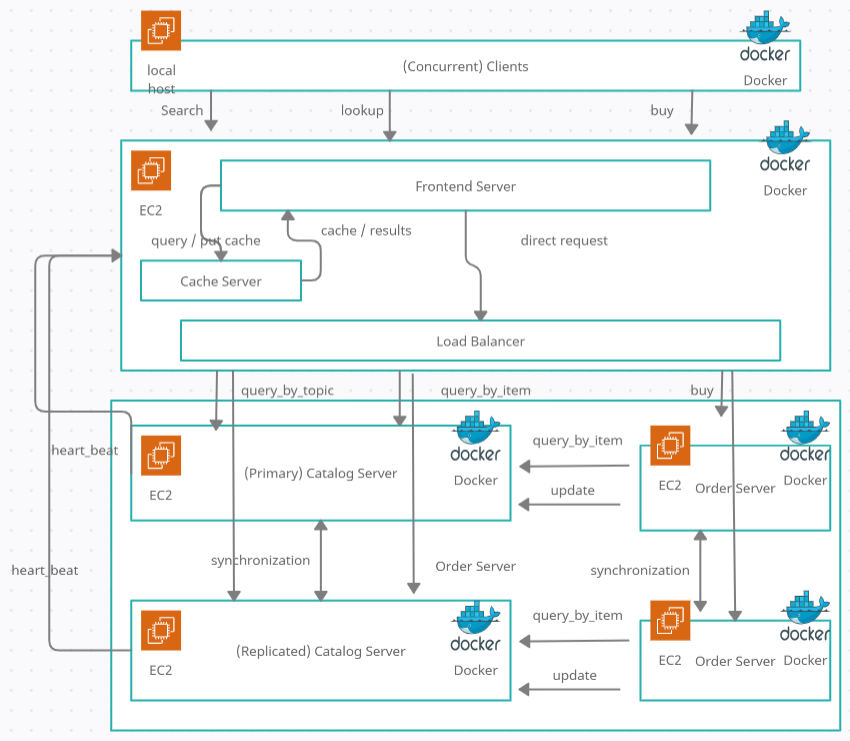
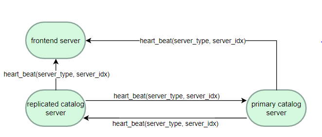

# My Book Store Design Doc

Authors: Chih-Che Fang

# System Design

## UML Class Diagram
### Backend Components

### Frontend + Client Componets

## Class Discription  
### Server Package
- **FrontendServer:** frontend server that process and dispatch client's request  
- **CatalogServer:** catalog server that host book information and can serve update, query_by_item, query_by_topic request from frontend and order server   
- **OrderServer:** order server that process frontend server's buy request  
- **CacheServer:** Cache server that store must recent & consistent search/query results  

### Communication Package
- **LoadBalancer:** A class used to direct HTTP request to replicated server evenly  
- **HeartBeater:** A class used to send beat to targeted server intermittently  
- **HeartBeaterListener:** A listener used to process and monitor heartbeat messages from other servers  
- **ReplicationProtocol:** A class used to implement replication consistency and fault tolerance  
- **Request:** A class used to perform secured & multi-threaded HTTP request  

### Client Package
- **Client:** A class used to perform test cases by sending multiple HTTP requests to the frontend server  

### Utils Package
- **Monitor:** A class used to store and calculate the latency/average response time of HTTP requests.  
- **Book:** A class used to store all book's detailed information like cost, title, topic, ...etc  
- **Config:** Store the address and health status of all servers  
- **Logger:** A class used to output log to files  

## REST API Description:  
### Frontend Server
- **search(topic)**: Allows the user to specify a topic and returns all entries belonging to that category (a title and an item number are displayed for each match).  
- **lookup(item_number)**: Allows an item number to be specified and returns details such as number of items in stock and cost  
- **buy(item_number)**: Allows client to buy a book with the item number  
- **heart_beat(server_type, serer_idx):** Process heartbeat messages from backend servers. This API allows the frontend server to monitor the health of backend servers  

### Catalog Server 
- **query_by_topic(topic)**: Allows the user to specify a topic and returns all entries belonging to that category (a title and an item number are displayed for each match).  
- **query_by_item(item_number)**: Allows an item number to be specified and returns details such as number of items in stock and cost  
- **update(item_number, cost, stock_update)**: Allows client to update cost or update the stock of book  
- **shutdown():** The API will shut down the catalog server, simulating a server crash fault  
- **recover():** The API will shut down the catalog server, simulating a server crash fault  
- **heart_beat(server_type, serer_idx):** Process heartbeat messages from backend servers. This API allows the frontend server to monitor the health of backend servers  
- **resync(server_idx):** This API process resync message from a just recovered server. This API allows the crashed server to sync the in-memory book database with replicas.
- **internal_update(book, cost, stock):** Process internal update requests from replicas. This API is part of the replication protocol and used for synchronization mechanism between replicas 

### Order Server   
- **buy(item_number)**: Allows the user to buy a book with a certain item number

### Cache Server
- **search(topic)**: Process search request from frontend server, it will return cache if it has the cache for the search request  
- **lookup(item_number)**: Process search request from frontend server, it will return cache if it has the cache for the search request  
- **put_search_cache(topic, res):**: The API allows the frontend server to put search result into the search cache  
- **put_lookup_cache(topic, res):**: The API allows the frontend server to put lookup result into the lookup cache  
- **invalidate_cache(item_number):** The API allows the catalog server to invalidate the cache in the cache server, forcing the cache server to remove outdated cache information  

## Sequence Diagram
**Client/Server Interaction Workflow**  

# How it Works
 ## Bootstrapping & Communication
I used Flask to implement each server. I start the frontend server, cache server, 2 replicated catalog servers, 2 replicated order servers in sequence, and finally launch the client to send an HTTP request to the frontend server.  
Each Client represents a thread so that multiple clients can request a single frontend server concurrently. Flask server supports multi-threaded so that the server will launch a new thread for processing each new client request. The single Client request is implemented as a synchronous request and will wait for the frontend server's response.  When the frontend server receives the client's request, it just launches a new HTTP request to the corresponding server.

Servers know each other's IP addresses and ports by reading the config file. The catalog server will read from init_bookstore to init the database of books. Book class is used to store all book's detailed information. Catalog and order server will output executed operation to catalog{id}_log and order{id}_log under the "output" folder. Initialization log has the following format:  

Format = **[Operation item_number stock cost Count topic title]**  

**Operation:** Indicate the executed operation  
**item_number:** Indicate the book's item number  
**stock:** Initial stock of the book  
**cost:** The cost of the book  
**topic:** The topic of the book  
**Title:** Indicate the book title  

Here is one example of book initialization information that a catalog used to init book status:  
[init,1,3,10,distributed systems,How to get a good grade in 677 in 20 minutes a day]  

## Load Balance Algorithm
I adopt a round-robin algorithm to request each server evenly  

## Replica Protocol

### Synchronization

I adopt primary backup as replication protocols. Both two replicated catalog/order support query operation. When the catalog server receives update requests (Ex. Buy transaction) it will have the following mechanism.  
- If primary server:  
 1.Perform update if it is valid (Ex. stock > 0)  
 2.Notify replicas to update  
 3.Notify cache server to invalidate the cache  
 4.Write executed transaction to log  
 5.Respond update result to the caller  

- If replicated server:  
 1. Notify primary to update  
 2. Wait for the primary server's response  
 3. Perform update transaction if it is valid. Otherwise, return failed message to caller  
 4. Write executed transaction to log  
 5. Respond update to the caller  

### Primary Selection
Since each replica has global knowledge about the address/port and health status of the replica. We can always use the healthy replica with the smallest id as the primary server. All replicas use this rule to know whether they are a primary or a normal replica  

## Fault Tolerance
### Fault Detection - Heart-Beat Mechanism
  
We let replicas send a heartbeat message to the frontend server and other replicas every second. Each server also set a heartbeat listener to monitor the health of other replicas every second. Once a listener doesn't receive a heartbeat from a certain server, the listener will mark that server as "died"   

### Primary Takeover
Each replica knows the id and health status of all other replicas. After detection of a crash fault, it can easily determine the new primary server by choosing the alive replica with the smallest id. It can also know whether itself is a primary or not.

### Resynchronization
  
After the crashed server recovered from a failure, it will:  
1.Send resync message to an alive replica.  
2.Replica re-select primary server  
3.Receive bookstore database information response and update its state  
4.Re-select primary server  
5.Send heartbeat message to frontend server to notify that the server is recovered again  

### Simulation for Server Shutdown and Recover
I implement two REST API in the catalog server for simulating server crash & recovery:  
- **Shutdown:** This API will stop the heartbeat of the catalog server so that frontend & another replica will detect the server crash after 1 second. The frontend server's load balancer will not direct any HTTP request to the crashed server anymore. Similarly, the other replica will detect the crash of the server, if the crashed server was a primary, the replica will reselect a replica to take over the primary server role.  
- **Recover:** This API will restart the heart beater of the catalog server. In this way, the frontend & another replica will soon detect the recovery of the catalog server and the load balancer will mark the server as alive and continue directing HTTP requests to the server as before. The other replica will reselect the primary server. The crashed will send resync requests to other replicas to sync the current book store database.  

## Transaction Request Format
**Lookup:**  
request: [SERVER_IP:8000/lookup/item_number], Ex. http://127.0.0.1/lookup?item_number=1  
response: {'item_number': item_number, 'stock':self.stock, 'cost': cost, 'type': type, 'title': title}, Ex. {'item_number': 1, 'stock':1000, 'cost': 50, 'type': distributed systems, 'title': How to get a good grade in 677 in 20 minutes a day.}  

**Search:**  
request: [SERVER_IP:8000/search/topic], Ex. http://127.0.0.1/search?topic=distributed systems  
response: {'result': book list}, Ex. {'result': [{'item_number': 1, 'title':How to get a good grade in 677 in 20 minutes a day},{'item_number': 2, 'title':RPCs for Dummies}]}  

**Buy:**  
request: [SERVER_IP:8000/buy/item_number], Ex. http://127.0.0.1/buy?item_number=1  
response: {'result': result}, Ex. {'result': Success}  

## Global IP/Port Address Configuration
To allow servers to communicate with each other, we need to give them other peer's addresses and ports, we use a file - config to record the information.
Format = **[Type, IPAddress:Port]**  

**Type:** Type of the server  
**IPAddress:Port:** The peer's ipv4 address and listening port  

Here is one example of configt file:  
frontend,127.0.0.1:8080  
catalog,127.0.0.1:8081  
catalog,127.0.0.1:8082  
order,127.0.0.1:8083  
order,127.0.0.1:8084  
cache,127.0.0.1:8085  

## Concurency / Race Condition Protection Proof
All books' information is stored in the catalog server's memory and shared by multiple threads concurrently. When a flask server receives a new client request, it will launch a new thread to process the message.  Therefore, when updating and read the book's information, we used a lock to make sure the whole update transaction is atomic in all servers. For example, a buy request from the order server will check the book's stock, and if there is enough stock, the server will then decrease the stock by 1. Otherwise, the buy operation should return a "fail" result. Consider the following error case without using lock:  

client 1 queried the stock of book item_number 1 is 1  
client 2 queried the stock of book item_number 1 is 1  
client 1 update book stock to 0  
client 2 updated book stock to 0  

To prevent the race condition mentioned above, we used a lock for buy operation:  

getLock()  
client 1 queried the stock of book item_number 1 is 1  
client 1 update book stock to 0  
releaseLock()  
getLock()  
client 2 queried the stock of book item_number 1 is 0  
client 2 buy failed  
releaseLock()  

Since we adopt a primary backup replication protocol, only the primary server can update the stock information at the same time. Using lock to prevent race condition on the primary server also prevents race condition in all replicas. Therefore, the system I designed can prevent race conditions.  

## Logging System
Under the output folder, I store the executed transaction with a file name of client_log, cache_log, catalog_log, order_log in each server/client respectively:  
Format = **[Operation args]**  

**Operation:** Execuated operation name  
**args:** Argumnets of the execuated operation  

Here is one example of execuated operation stored by catalog server:  
[query_by_item,2]  
[update,2,na,-1]  

## Automatic Distributed Server Deployment
### 1.Pre-created AMI image  
We already create an Amazon Linux2 AMI image with Docker installed and made it public to access, later we can create new EC2 instances from the image, it provides us a machine that can build and run a docker image

### 2.Dynamic creation of key pair
We will create a key pair in the AWS account for later access to EC2 instances  

### 3.Dynamic security group
We dynamically create a security group and open HTTP port 8000-8002, 22 for servers

### 4.Dynamic server creation
We have pr-created Amazon AMI image that has Docker installed. We dynamically create a security group that allows HTTP REST API access permission. We create an EC2 instance from the pre-created AMI image and attached it with the created security group. We tag each EC2 instance with a tag MyBookStore32144321" so that we can later access them and release them.

### 5.Dynamic code migration and docker image build-up
We migrate the latest code to the remote server using SCP and invoke script ec2_setup.sh to build the docker image, run the docker image, and start the corresponding server on that EC2 machine

### 6.Perform all testing cases
We automatically build a docker image for the client and run the client in a container. Then the client can launch multiple threads and perform multiple HTTP requests to the frontend server. That is, the client will run all test cases in order and send requests to the frontend server.

### 7.Gather test output(log) for validation
We use SCP to pull test logs under the output folder from all remote servers. We store the output from each server to the local machine's output folder. The output is named with catalog{id}_log and order{id}_log, cache_log, which represent the catalog server's log, order server's log, cache server's log respectively.  
We also store the client log named client_log to know what requests have been performed and what responses got from servers.  

### 8.Release AWS resource
We terminate all EC2 instances, delete the security group, and key pairs & temporary files created previously at the end of the test

# Validation & Test
## Test Cases
- **test1:** (Verify Search transaction + Cache) Perform search requests for each topic twice, verify we get the same and correct result  
- **test2:** (Verify Lookup transaction + Cache) Perform lookup methods for each book twice, verify we get the same and correct result  
- **test3:** (Verify Buy transaction + Replication/Cache Consistency + Loadbalance) Process Buy request and update the book stock correctly with Frontend server direct requests to servers evenly. Also, check the cache consistency after several buy transaction  
- **test4:** (Verify Replication/Cache Consistency + Race Condition Protection) 4 concurrent clients buy the book "RPCs for Dummies" that only has 3 stock concurrently, only 3 clients can buy the book 
- **test5:** (Verify Fault tolerance) After the primary catalog server crashed, the Frontend server can still correctly process update and query requests. Check alive replica will take over the primary job correctly.  
- **test6:** (Verify Fault tolerance) Primary catalog server can correctly recover from failing and resync with replicas  
- **test7:** (Verify Fault tolerance) Same with test5, but the crashed server is a replicated catalog server  
- **test8:** (Verify Fault tolerance) Same with test 6, but the recovered server is a replicated catalog server   
- **test9:** (Verify Distributed System) Run all of the above test cases, but deploy servers on 5 remote EC2 machines, with each of the components and replicas on different machines

## Automatic Test Scripts
- **run_local_test.bat:** This script will automatically start the frontend, cache, catalog, and order server on the local machine in a container. Then, run a client in a container and perform all test cases in order on a local machine. Finally, store output under the output folder for validation.  

- **run_distributed_test.bat:**  This script will automatically create 5 Amazon EC2 instances, migrating code and config file to remote servers, building docker image, deploying the corresponding server, on remote servers. Next, deploy a client on a local machine and perform all test cases in order on remote EC2 instances. Finally, store output under the output folder for validation and release all cloud resources. For more detail please see the chapter, "How it Works/Automatic Distributed Server Deployment".  

## Test Output (Log)  
We store all testing output under the output folder and use them to validate the correctness of each test case. There are three types of logs:  
- catalog{id}_log: store all executed transaction on the catalog server with id = {id}  
- order{id}_log: store all executed transaction on the order server with id = {id}  
- cache_log: store all executed transaction on the cache server  
- client_log: store all executed HTTP request and response log for all concurrent clients  

## Verification of All Test Cases  
### Test1 output: Perform search methods correctly  
**Client Log:**  
Client0: Send request http://127.0.0.1:8000/search?topic=distributed%20systems
Client0: Get response {'result': [{'item_number': '1', 'title': 'How to get a good grade in 677 in 20 minutes a day'}, {'item_number': '2', 'title': 'RPCs for Dummies'}]}
Client0: Send request http://127.0.0.1:8000/search?topic=graduate%20school
Client0: Get response {'result': [{'item_number': '3', 'title': 'Xen and the Art of Surviving Graduate School'}, {'item_number': '4', 'title': 'Cooking for the Impatient Graduate Student'}, {'item_number': '5', 'title': 'How to finish Project 3 on time'}, {'item_number': '6', 'title': 'Why theory classes are so hard'}]}
Client0: Send request http://127.0.0.1:8000/search?topic=distributed%20systems
Client0: Get response {'result': [{'item_number': '1', 'title': 'How to get a good grade in 677 in 20 minutes a day'}, {'item_number': '2', 'title': 'RPCs for Dummies'}]}
Client0: Send request http://127.0.0.1:8000/search?topic=graduate%20school
Client0: Get response {'result': [{'item_number': '3', 'title': 'Xen and the Art of Surviving Graduate School'}, {'item_number': '4', 'title': 'Cooking for the Impatient Graduate Student'}, {'item_number': '5', 'title': 'How to finish Project 3 on time'}, {'item_number': '6', 'title': 'Why theory classes are so hard'}]}

**Cache Server Log:**  
search,distributed systems  
put_search_cache,distributed systems  
search,graduate school  
put_search_cache,graduate school  
search,distributed systems  
search,graduate school  

**Catalog Server 0 Log:**    
query_by_topic,graduate school

**Catalog Server 1 Log:**   
query_by_topic,distributed systems

**Result:** Pass, client correctly find all books related to the topic "distributed system" and "graduate school". The catalog servers correctly stored the two search operations. The cache server is correctly requested and updated. Loadbalancer correctly requests each catalog server according to the round-robin algorithm.       

### Test2 (Verify Lookup transaction + Cache) Perform lookup methods for each book twice, verify we get the correct result
**Client Log:**   
Client0: Send request http://127.0.0.1:8000/lookup?item_number=1  
Client0: Get response {'result': {'cost': '10', 'item_number': '1', 'stock': 3, 'title': 'How to get a good grade in 677 in 20 minutes a day', 'type': 'distributed systems'}}  
Client0: Send request http://127.0.0.1:8000/lookup?item_number=1  
Client0: Get response {'result': {'cost': '10', 'item_number': '1', 'stock': 3, 'title': 'How to get a good grade in 677 in 20 minutes a day', 'type': 'distributed systems'}}  
Client0: Send request http://127.0.0.1:8000/lookup?item_number=2  
Client0: Get response {'result': {'cost': '20', 'item_number': '2', 'stock': 3, 'title': 'RPCs for Dummies', 'type': 'distributed systems'}}  
Client0: Send request http://127.0.0.1:8000/lookup?item_number=2  
Client0: Get response {'result': {'cost': '20', 'item_number': '2', 'stock': 3, 'title': 'RPCs for Dummies', 'type': 'distributed systems'}}  
Client0: Send request http://127.0.0.1:8000/lookup?item_number=3  
Client0: Get response {'result': {'cost': '5', 'item_number': '3', 'stock': 3, 'title': 'Xen and the Art of Surviving Graduate School', 'type': 'graduate school'}}  
Client0: Send request http://127.0.0.1:8000/lookup?item_number=3  
Client0: Get response {'result': {'cost': '5', 'item_number': '3', 'stock': 3, 'title': 'Xen and the Art of Surviving Graduate School', 'type': 'graduate school'}}  
Client0: Send request http://127.0.0.1:8000/lookup?item_number=4  
Client0: Get response {'result': {'cost': '15', 'item_number': '4', 'stock': 6, 'title': 'Cooking for the Impatient Graduate Student', 'type': 'graduate school'}}  
Client0: Send request http://127.0.0.1:8000/lookup?item_number=4    
Client0: Get response {'result': {'cost': '15', 'item_number': '4', 'stock': 6, 'title': 'Cooking for the Impatient Graduate Student', 'type': 'graduate school'}}  
Client0: Send request http://127.0.0.1:8000/lookup?item_number=5  
Client0: Get response {'result': {'cost': '15', 'item_number': '5', 'stock': 3, 'title': 'How to finish Project 3 on time', 'type': 'graduate school'}}  
Client0: Send request http://127.0.0.1:8000/lookup?item_number=5  
Client0: Get response {'result': {'cost': '15', 'item_number': '5', 'stock': 3, 'title': 'How to finish Project 3 on time', 'type': 'graduate school'}}  
Client0: Send request http://127.0.0.1:8000/lookup?item_number=6  
Client0: Get response {'result': {'cost': '15', 'item_number': '6', 'stock': 3, 'title': 'Why theory classes are so hard', 'type': 'graduate school'}}  
Client0: Send request http://127.0.0.1:8000/lookup?item_number=6  
Client0: Get response {'result': {'cost': '15', 'item_number': '6', 'stock': 3, 'title': 'Why theory classes are so hard', 'type': 'graduate school'}}  
Client0: Send request http://127.0.0.1:8000/lookup?item_number=7  
Client0: Get response {'result': {'cost': '15', 'item_number': '7', 'stock': 3, 'title': 'Spring in the Pioneer Valley', 'type': 'travel'}}  
Client0: Send request http://127.0.0.1:8000/lookup?item_number=7  
Client0: Get response {'result': {'cost': '15', 'item_number': '7', 'stock': 3, 'title': 'Spring in the Pioneer Valley', 'type': 'travel'}}  

**Cache Server Log:**  
lookup,1
put_lookup_cache,1  
lookup,1  
lookup,2  
put_lookup_cache,2  
lookup,2  
lookup,3  
put_lookup_cache,3  
lookup,3  
lookup,4  
put_lookup_cache,4  
lookup,4    
lookup,5  
put_lookup_cache,5  
lookup,5    
lookup,6      
put_lookup_cache,6  
lookup,6  
lookup,7  
put_lookup_cache,7  
lookup,7  

**Catalog Server 0 Log:**  
query_by_item,2  
query_by_item,4  
query_by_item,6  

**Catalog Server 1 Log:**  
query_by_item,1
query_by_item,3
query_by_item,5
query_by_item,7

**Result:** Pass, client correctly get detailed information of book item_number 1 ~ 7. The two catalog servers correctly stored the 7 lookup operations. The cache is correctly updated and requested. Loadbalancer correctly requests each catalog server according to the round-robin algorithm.  

### Test3 output: Run Buy operations and update the stock of the item correctly
**Client Log:**  
Client0: Send request http://127.0.0.1:8000/buy?item_number=1  
Client0: Get response {'result': 'Success'}  
Client0: Send request http://127.0.0.1:8000/buy?item_number=1  
Client0: Get response {'result': 'Success'}  
Client0: Send request http://127.0.0.1:8000/buy?item_number=1  
Client0: Get response {'result': 'Success'}  
Client0: Send request http://127.0.0.1:8000/buy?item_number=1  
Client0: Get response {'result': 'Failed'}  

**Cache Server Log:**  
invalidate_cache,1  
invalidate_cache,1  
invalidate_cache,1  

**Catalog Server 0 Log:**  
update,1,na,-1  
query_by_item,1  
update,1,na,-1  
update,1,na,-1  

**Catalog Server 1 Log:**  
update,1,na,-1  
update,1,na,-1   
query_by_item,1  
update,1,na,-1  

**Order Server 0 Log:**   
bought book 1

**Order Server 1 Log:**  
bought book 1  
bought book 1  

**Result:** Pass, book item_number 1 only has 3 stock. The first of 3 client's buy requests should succeed and the last one should fail. The order server correctly stored only the three succeded buy operation. The catalog server correctly logs the 3 executed queries and 3 update requests. Each catalog replica exactly decreases the stock 3 times, which is the same in all replica.  The cache server is correctly invalidated after the update transaction.  

### Test4 output: (Race Condition) 4 clients buy the book "RPCs for Dummies" that only has 3 stock concurrently, only 3 clients can buy the book 
**Client Log:**  
Client1: Send request http://127.0.0.1:8000/buy?item_number=2  
Client2: Send request http://127.0.0.1:8000/buy?item_number=2  
Client3: Send request http://127.0.0.1:8000/buy?item_number=2  
Client4: Send request http://127.0.0.1:8000/buy?item_number=2  
Client1: Get response {'result': 'Success'}  
Client2: Get response {'result': 'Success'}  
Client3: Get response {'result': 'Success'}  
Client4: Get response {'result': 'Failed'}  

**Cache Server Log:**  
invalidate_cache,2  
invalidate_cache,2  
invalidate_cache,2  

**Catalog Server 0 Log:**  
query_by_item,2  
update,2,na,-1  
update,2,na,-1  
update,2,na,-1  
query_by_item,2  

**Catalog Server 1 Log:**  
query_by_item,2  
query_by_item,2  
query_by_item,2  
update,2,na,-1  
update,2,na,-1  
update,2,na,-1  

**Order Server 0 Log:**   
bought book 2     

**Order Server 1 Log:**  
 bought book 2    
 bought book 2    

**Result:** Pass, book item_number 2 only has 3 stock. The first of 3 concurrent client's buy requests should return success and the last one should return fail. The order server correctly stored only the 3 succeded buy operation. The catalog server correctly logs the 4 executed queries and 3 update requests. Each catalog replica exactly decreases the stock 3 times, which is the same in all replica. The cache server is correctly invalidated after the update transaction.  

### Test5 output: (Verify Fault tolerance) After the primary catalog server crashed, the Frontend server can still correctly process update and query requests. Check alive replica will take over the primary job correctly.  
**Client Log:**  
Client0: Send request http://127.0.0.1:8001/shutdown  
Client0: Get response {'result': 'Succeed'}  
Client0: Send request http://127.0.0.1:8000/buy?item_number=4  
Client0: Get response {'result': 'Success'}  
Client0: Send request http://127.0.0.1:8000/buy?item_number=4  
Client0: Get response {'result': 'Success'}  
Client0: Send request http://127.0.0.1:8000/buy?item_number=4  
Client0: Get response {'result': 'Success'}  

**Cache Server Log:**  
invalidate_cache,4  
invalidate_cache,4   
invalidate_cache,4   

**Catalog Server 0 Log:**  
None (Crashed)  

**Order Server 0 Log:**  
None (Crashed)  

**Catalog Server 1 Log:**  
query_by_item,4  
update,4,na,-1  
query_by_item,4  
update,4,na,-1  
query_by_item,4  
update,4,na,-1  

**Order Server 1 Log:**  
bought book 4  
bought book 4  
bought book 4  

**Result:** Pass, Catalog Server 0 is the primary server and crashed by issuing a shutdown request. Catalog server 1 correctly takes over the primary server's job and can update the database normally. The clients can still correctly perform buy transactions even if catalog server 0 crashed. A cache server is correctly invalidated after the buy transaction. Note that we can know from the log that the frontend server has detected the crash since no following request is sent to catalog server 0 under round-robin load-balancing algorithms. Also, catalog server 1 can perform updates, which means it knows the old primary server has crashed and now itself is the new primary and can perform the update.

### Test6 Output: (Verify Fault tolerance) Primary catalog server can correctly recover from a fail and resync with replicas  
**Client Log:**  
Client0: Send request http://127.0.0.1:8001/recover  
Client0: Get response {'result': 'Succeed'}  
Client0: Send request http://127.0.0.1:8002/query_by_item?item_number=4  
Client0: Get response {'result': {'cost': '15', 'item_number': '4', 'stock': 3, 'title': 'Cooking for the Impatient Graduate Student', 'type': 'graduate school'}}  
Client0: Send request http://127.0.0.1:8001/query_by_item?item_number=4  
Client0: Get response {'result': {'cost': '15', 'item_number': '4', 'stock': 3, 'title': 'Cooking for the Impatient Graduate Student', 'type': 'graduate school'}}  
  
**Catalog Server 0 Log:**  
shutdown  
recover  
query_by_item,2  

**Catalog Server 1 Log:**  
resync,0  
query_by_item,2  

**Result:** Pass, Catalog Server 0 is crashed and then recovered by issuing the recover request. It correctly performed resync transactions with catalog server 1 and has the same bookstore database with catalog server 1. We checked the stock by querying the two servers the information of book 4, which is bought 3 times during the time the catalog server 0 crashed. From the log, we see the same stock information of book 4 and therefore know the crashed server successfully resync with another replica.  

### Test7 Output:** (Verify Fault tolerance) Same with test5, but the crashed server is a replicated catalog server 
Same logic as test 5  
### Test8 Output: (Verify Fault tolerance) Same with test 6, but the recovered server is a replicated catalog server 
Same logic as test 6

### Test9 Output: (Verify Distributed System) Run all of the above test cases, but deploy servers on 5 remote EC2 machines, with each of the components and replicas on different machines
**Result:** Pass, All test1 ~ test 8 log is the same as run in local machine

# Evaluation and Measurements
## 1.	Compute the average response time (query/buy) of your new systems.  What is the response time with and without caching? How much does caching help?  

### Search Transaction  
  

### Lookup Transaction  
  

### Buy Transaction  
  

PS: all response time sampled from 1000 requests  

- Results show averaged response times increases as concurrent client increases. Even though all servers adopted multi-thread to handle client requests, the server still needs time to process the request and launch a new thread. Too much request during a short time still makes the frontend and catalog server become a bottleneck and therefore the averaged time increases.  
- Cache improves both query transaction's averaged response time by about 3 ~ 4ms, it fits what we found out in Lab2 that latency between EC2 machine is quite low (about 4ms). Cache only save the time of the latency between the frontend server and catalog server  
- Cache cannot improve the averaged response time of buy transaction. It makes sense since we only use cache in query transactions.  

## 2.	Construct a simple experiment that issues orders or catalog updates (i.e., database writes) to invalidate the cache and maintain cache consistency. What is the overhead of cache consistency operations? What is the latency of a subsequent request if it sees a cache miss?  
The overhead of cache consistency is the time used to invalidate cache + subsequent request if it sees a cache miss.  
The averaged response time of invalidating cache = 0.27ms  (Note that this is the time to create a new thread that sending invalidation HTTP request since I use asynchronous request and don't need to wait for a response)  
The averaged response time subsequent request if it sees a cache miss = time to request catalog server + time to put new cache into cache server = 4.1ms  
Total overhead = 4.1 + 0.27ms = 4.37ms  
We need this overhead every time the catalog server updates its database. If the write transaction is less than reading, it is worthy to use cache for improving the read latency. However, if the write transaction is much more than the reading operation, then the benefits of cache are not obvious since cache only improves query latency 3~4 ms.  

## 3. Construct an experiment to show your fault tolerance does the work as you expect. You should start your system with no failures and introduce a crash fault and show that the fault is detected and the other replica can mask this fault. Also, be sure to show the process of recovery and resynchronization.  
See [How it works#Fault Tolerance Part](https://github.com/Chih-Che-Fang/MyBookStore2/blob/main/docs/design.md#test6-output-verify-fault-tolerance-primary-catalog-server-can-correctly-recover-from-a-fail-and-resync-with-replicas) for how we implement fault tolerance mechanism and how we simulate a crashed server that later recovered.  
See [test case 5/test case 7](https://github.com/Chih-Che-Fang/MyBookStore2/blob/main/docs/design.md#test5-output-verify-fault-tolerance-after-primary-catalog-server-crashed-frontend-server-can-still-correctly-process-update-and-query-requests-check-alive-replica-will-take-over-the-primary-job-correctly) for the outcome of the experiment of fault detection and replica fault mask.  
See [test case 6/test case 8](https://github.com/Chih-Che-Fang/MyBookStore2/blob/main/docs/design.md#test6-output-verify-fault-tolerance-primary-catalog-server-can-correctly-recover-from-a-fail-and-resync-with-replicas) for experiments outcome of recovery and resynchronization.  
 
 
  

# Design Tradeoffs
## Primary-Backup Replication Protocol V.S Local-Write Protocol
We must choose one replication protocol for replication consistency. The pros of the primary-backup protocol are:  
1. Easier to implement and guarantee sequential consistency
2. Save the network bandwidth to move an object we want to update

The cons of the primary-backup protocol are:   
1. Primary perform all updates and may become the bottleneck  
2. Block on write until all replicas are notified, potential to increase write latency  

I finally choose primary backup replication. The reason is that this allows me to guarantee consistency and prevent race conditions easier under multiple client environments. However, the cost is that primary may become the bottleneck and increase on write latency.  

## Round-Robin Load Balancing V.S Weighted Round-Robin Load Balancing
To implement load-balance, we must choose one load-balancing algorithm. The pros of round-robin are:  
1.Very easy to implement
The cons of the round-robin algorithm are:  
1.If each backend replication have a different computing power and network capability, we cannot optimize the workload to each server based on replication capability  

I finally chose round-robin since we use AWS EC2 as our backend replicated servers. We can trust the auto-scaling ability provided by AWS EC2 and assume each replicated server has about the same computing power and network bandwidth.  Since round-robin is fair under the assumption of an equal replicated server, we can easily implement the algorithms.  

## Server-push Model V.S Client-pull Model
To maintain the consistency between cache and catalog server, we need to choose one way of cache synchronization model. The pros of the server-push model are:  
1.Client don't need to keep polling the server, saving the polling effort of client and responding effort of server-side  

The cons of the server-push model are:  
1.If there are many clients, the server might become a bottleneck since it needs to send a large number of messages to all clients  

I finally chose the Server-push model as it saves the polling effort for each client and we didn't give how many clients each server may have.

## Resync database status V.S Resync executed transaction
To implement fault tolerance, we need a way of resynchronization for crashed server. The pros of resync database status with other replicas are:  
1.System design is quite simple  
2.Don't worry about non-deterministic transaction executed on different server states as we directly current status of the database  
The cons of resync database status with other replicas are:  
1.If the database is large, the way cannot work an as large amount of data can congest the network and may become a bottleneck operation
2.If the database is large, it costs a lot of time to recover

In this lab, I chose to resync database status with other alive replicas when doing resynchronization. The reason is fewer worries about the consistency between replicas and makes system design concise and simple. However, if the database becomes very large, we may need to implement a checkpoint/log and resync executed transactions with other replicas. 

## High Heart Beat Frequency V.S Low Heart Beat Frequency  
To implement fault tolerance, we need a heartbeat mechanism with a certain frequency. The pros of high heartbeat frequency are:  
1. another server can quickly detect a crashed server    
The cons of high heartbeat frequency are:  
1.Congested the network with a heartbeat message  
2.Cost server computing power to process heart messages  
3.May increase the rate of false-positive: A server might just have a slower response  

it is hard to determine a suitable heartbeat frequency for all servers. Our bottom line is that replicas must detect the crashed server fast enough so that it will not cause any consistency problem. Finally, with the experiment, we set 1/per second as our heartbeat frequency.  

## Pessimistic Concurrency Control (Lock) V.S Optimistic Concurrency Control (Transaction Validation Mechanism)  
We need concurrency control to make sure that transaction is consistent and atomic and prevent race condition happen. The pros of using Pessimistic Concurrency Control (Lock) is:    
1. Don't need to worry about transaction starvation  
2. Don't need to re-run the transaction and implement a complicated transaction check mechanism  

The cons of Pessimistic Concurrency Control (Lock) is:  
1. Potential deadlock may happen
2. Acquiring/releasing lock cause extra overhead and may hurt efficiency

We finally chose Pessimistic Concurrency Control (Lock) since race conditions happen too frequently when concurrent clients> 5. By doing so, we skip starvation and re-run problems. It also makes the design simpler. Besides, since only the catalog server uses the lock, it is easy to skip the deadlock problem.  

# How to Run It

See [README.md #How to run?](https://github.com/Chih-Che-Fang/MyBookStore2/blob/main/README.md "How to run")

# Possible Improvements and Extensions

1. Currently we only have one frontend server and cache server, as the customer clients increase, the frontend may become the bottleneck and single point of failure, we can adopt replication to the frontend and cache server too  
2. Primary backup protocol may cause primary server a bottleneck as several customers increase. Besides, it only supports sequential consistency. We can adopt Paxos/RAFT consensus mechanism to achieve linearizability consistency, which is stronger than the sequential model  
3. In this lab, I chose to resync database status with other alive replicas when doing resynchronization. The reason is fewer worries about the consistency between replicas and makes system design concise and simple. However, if the database becomes very large, we may need to implement a checkpoint/log and resync executed transactions with other replicas. 
4. We are using the thread per request model currently. Therefore, we could optimize averaged response latency time by using thread pool since each request doesn't need to wait for the launch time of a thread  
